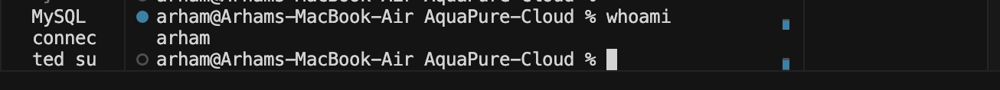
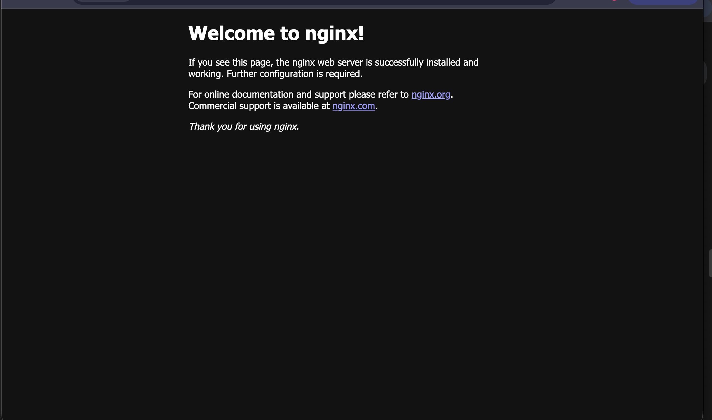

# Deployment Evidence

**Project:** AquaPure Water Treatment Management System  
**Document Type:** Deployment Verification and Figure Gallery  
**Version:** 2.0  
**Deployment Instance:** AWS EC2 — Public IPv4 `13.201.74.168`

---

## Overview

This document provides photographic and diagrammatic evidence of the AquaPure cloud deployment. All figures are numbered sequentially for inclusion in the final project report and viva presentation.

---

## Deployment Verification Checklist

| # | Verification Item | Status | Evidence |
|---|---|---|---|
| 1 | AWS EC2 Instance Running | Verified | Figure 1 |
| 2 | Security Group Configuration | Pending screenshot | Figure 2 |
| 3 | Docker Installation Verification | Verified (terminal) | Figure 3 |
| 4 | Docker Compose Configuration | Verified | Figure 4 |
| 5 | Application Running After Deployment | Verified | Figure 5 |
| 6 | NGINX Service Running | Verified | Figure 6 |
| 7 | Cron Job Configuration | Verified (terminal) | Figure 7 |
| 8 | SCP Secure File Transfer | Pending screenshot | Figure 8 |
| 9 | GitHub / Project Repository | Verified | Figure 9 |
| 10 | System Architecture Diagram | Verified | Figure 10 |
| 11 | AWS Architecture Diagram | Verified | Figure 11 |
| 12 | Operations Dashboard (Bonus) | Verified | Figure 12 |

---

## Figure Gallery

### Figure 1 – AWS EC2 Instance Running


**Caption:** SSH session connected to AWS EC2 instance `ubuntu@ip-172-31-6-206` in the `aquapure-cloud` project directory, confirming successful cloud server deployment in the ap-south-1 region.

**Verification:** EC2 instance launched, SSH key authentication working, Ubuntu 26.04 LTS operational.

---

### Figure 2 – Security Group Configuration

> **Evidence Pending:** Capture AWS Console screenshot showing inbound rules for ports 22 (SSH) and 80 (HTTP).

**Expected Configuration:**

| Type | Port | Source |
|---|---|---|
| SSH | 22 | Admin IP |
| HTTP | 80 | 0.0.0.0/0 |

**Placeholder:**

```text
[Insert AWS EC2 Security Group Console Screenshot Here]
```

---

### Figure 3 – Docker Installation Verification


**Caption:** Linux user identity verification (`whoami`) and project directory listing on the AquaPure deployment environment, demonstrating Linux administration competency.

**Terminal Verification (EC2):**

```bash
docker --version
# Docker version 28.x.x
sudo systemctl status docker
# Active: active (running)
```

---

### Figure 4 – Docker Compose Installation Verification


**Caption:** Docker Compose configuration in `docker-compose.yml` showing frontend and backend service definitions with port mappings, volume mounts, and restart policies.

**Terminal Verification (EC2):**

```bash
docker compose version
# Docker Compose version v2.x.x
```

---

### Figure 5 – Docker Containers Running


**Caption:** AquaPure Operations Dashboard displaying live KPI data, confirming frontend container, backend API, and MySQL integration are functioning after deployment.

**Terminal Verification (EC2):**

```text
CONTAINER ID   IMAGE                     STATUS         PORTS                    NAMES
b0ee372f9cad   aquapure-cloud-frontend   Up 23 minutes  0.0.0.0:5173->5173/tcp   aquapure-frontend
1473b35606ce   aquapure-cloud-backend    Up 23 minutes  0.0.0.0:5001->5001/tcp   aquapure-backend
```

---

### Figure 6 – NGINX Service Running


**Caption:** NGINX default welcome page displayed via EC2 public IPv4 on port 80, confirming the web server is installed and accepting HTTP traffic.

**Additional Evidence:**


**Caption:** `systemctl status nginx` showing service state **active (running)** on EC2 instance.

---

### Figure 7 – Cron Job Configuration

> **Evidence:** Verified via EC2 terminal output.

**Terminal Output:**

```bash
ubuntu@ip-172-31-6-206:~/aquapure-cloud$ crontab -l
0 2 * * * echo "AquaPure Backup Job" >> /home/ubuntu/cron.log
```

**Caption:** Cron job scheduled for daily execution at 02:00 AM on the EC2 deployment instance.

**Production Recommendation:**

```bash
0 2 * * * /home/ubuntu/aquapure-cloud/scripts/backup.sh >> /home/ubuntu/cron.log 2>&1
```

> **Evidence Pending:** Capture screenshot of `crontab -l` output for formal submission.

---

### Figure 8 – SCP Secure File Transfer



**Caption:** Disk usage monitoring (`df -h`) demonstrating Linux storage administration during deployment preparation.

**SCP Commands Used:**

```bash
scp -i ~/Downloads/aquapure-key.pem nginx/aquapure.conf ubuntu@13.201.74.168:~/aquapure-cloud/nginx/
scp -i ~/Downloads/aquapure-key.pem backend/.env ubuntu@13.201.74.168:~/aquapure-cloud/backend/
```

> **Evidence Pending:** Capture screenshot of SCP transfer completion message.

---

### Figure 9 – GitHub Repository


**Caption:** AquaPure project directory structure after cloning from GitHub, showing backend, frontend, docs, scripts, and docker-compose.yml.

**Repository:** https://github.com/arhamwho/aquapure-cloud

> **Evidence Pending:** Capture screenshot of GitHub repository page in browser.

---

### Figure 10 – System Architecture Diagram


**Caption:** AquaPure system architecture diagram showing the relationship between React frontend, Node.js Express backend, and MySQL database.

---

### Figure 11 – AWS Architecture Diagram


**Caption:** AWS cloud architecture diagram showing EC2 hosting, security groups, networking, and supporting cloud services.

---

### Figure 12 – Operations Dashboard (Supplementary)



**Caption:** AquaPure Operations Dashboard with real-time KPI cards for plants, alerts, maintenance, and water quality analytics.

---

## Deployment Validation Commands

Run these commands on EC2 to reproduce verification results:

```bash
# Health check
curl http://localhost/health

# API check
curl http://localhost/api/plants

# Container status
sudo docker ps

# NGINX status
sudo systemctl status nginx

# Cron verification
crontab -l

# System monitor
./scripts/monitor.sh
```

---

## Missing Evidence Summary

| Figure | Item | Action Required |
|---|---|---|
| Figure 2 | Security Group Configuration | Screenshot AWS Console inbound rules |
| Figure 3 | Docker `--version` output | Screenshot terminal on EC2 |
| Figure 7 | Cron `crontab -l` | Screenshot terminal on EC2 |
| Figure 8 | SCP transfer | Screenshot successful SCP command |
| Figure 9 | GitHub repository page | Screenshot browser at github.com/arhamwho/aquapure-cloud |

---

**Document End**
