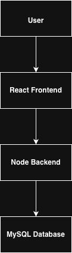
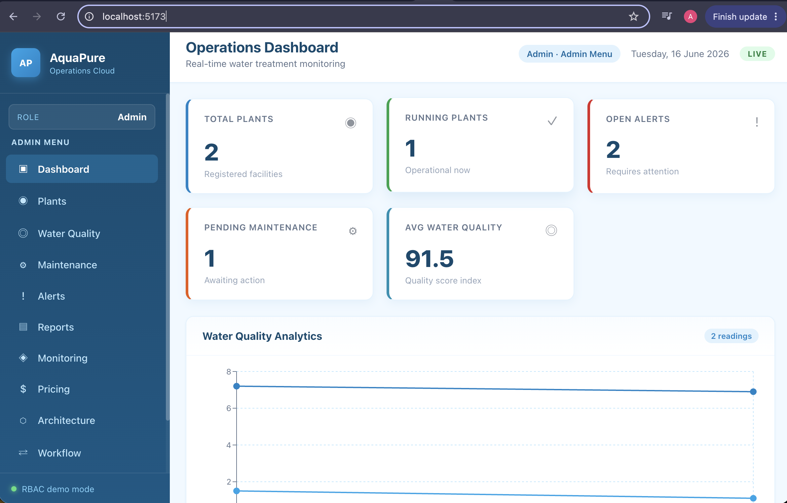
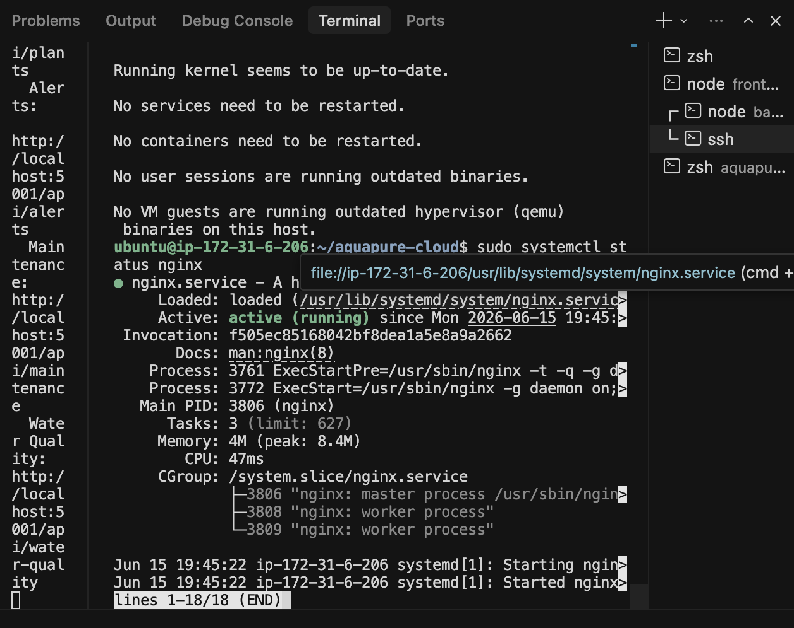
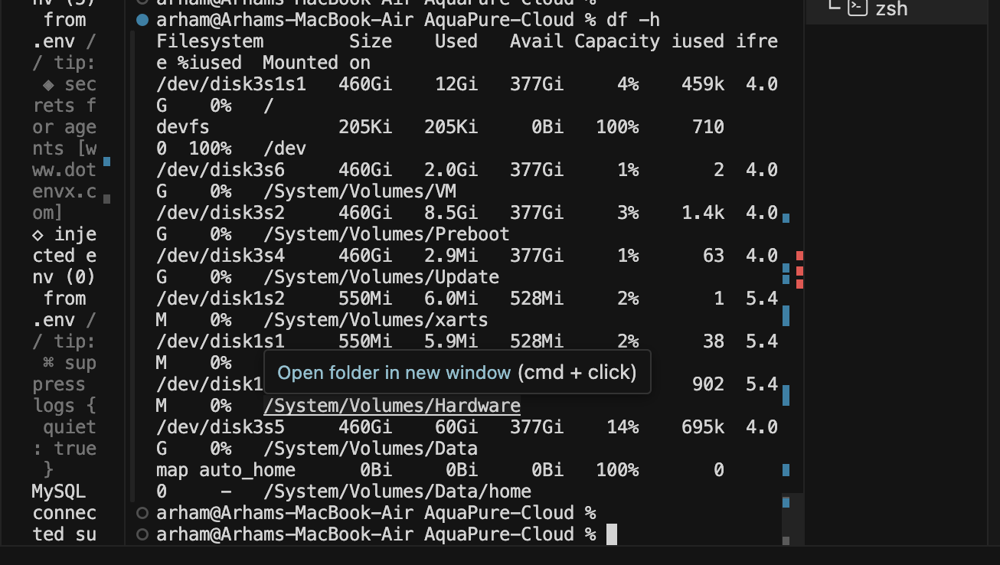
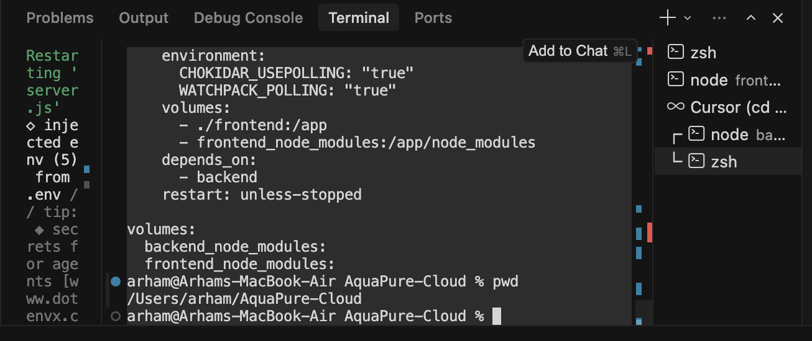
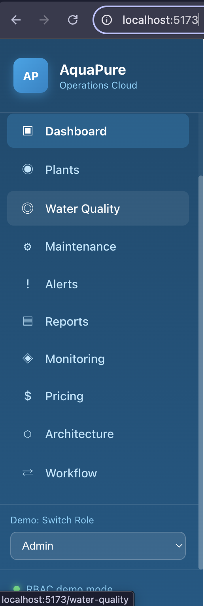

# AquaPure Water Treatment Management System

## Final Project Report

**Project Title:** AquaPure Water Treatment Management System  
**Document Type:** Final Year Project Report  
**Version:** 2.0 — Submission Ready  
**Author:** Arham  
**Repository:** [github.com/arhamwho/aquapure-cloud](https://github.com/arhamwho/aquapure-cloud)  
**Deployment:** AWS EC2 — Public IPv4 `13.201.74.168`  
**Date:** June 2026

---

## Table of Contents

1. [Introduction](#chapter-1-introduction)
2. [System Overview](#chapter-2-system-overview)
3. [Requirements Traceability Matrix](#chapter-3-requirements-traceability-matrix)
4. [Deployment and Infrastructure](#chapter-4-deployment-and-infrastructure)
5. [Deployment Procedure](#chapter-5-deployment-procedure)
6. [Deployment Verification](#chapter-6-deployment-verification)
7. [Testing and Validation](#chapter-7-testing-and-validation)
8. [Viva Preparation Summary](#chapter-8-viva-preparation-summary)
9. [Conclusion and Future Enhancements](#chapter-9-conclusion-and-future-enhancements)
10. [References and Supporting Documents](#chapter-10-references-and-supporting-documents)

---

## Chapter 1 — Introduction

### 1.1 Background

Water treatment facilities require continuous monitoring of plant operations, water quality parameters, maintenance schedules, and alert management. Manual record-keeping is inefficient and error-prone. **AquaPure Water Treatment Management System** addresses this need through a cloud-enabled web platform.

### 1.2 Problem Statement

Treatment plant operators and managers lack a centralized digital system to monitor plants, track water quality, manage maintenance, and generate operational reports in real time.

### 1.3 Objectives

1. Develop a React-based dashboard for water treatment operations
2. Implement a Node.js REST API connected to MySQL
3. Containerize the application using Docker and Docker Compose
4. Deploy the system on AWS EC2 with NGINX reverse proxy
5. Automate backups and monitoring using Linux cron jobs and shell scripts
6. Document Linux administration, networking, and cloud deployment practices

### 1.4 Scope

The project includes frontend dashboard modules, backend REST APIs, MySQL database schema, Docker deployment, AWS EC2 hosting, NGINX configuration, automation scripts, and comprehensive technical documentation.

---

## Chapter 2 — System Overview

### 2.1 Technology Stack

| Layer | Technology | Version / Detail |
|---|---|---|
| Frontend | React + Vite | SPA with React Router |
| Backend | Node.js + Express | Port 5001 |
| Database | MySQL | Database: `aquapure` |
| Containerization | Docker + Docker Compose | 2 services |
| Reverse Proxy | NGINX | Port 80 |
| Cloud Platform | AWS EC2 | Ubuntu 26.04 LTS, ap-south-1 |
| Version Control | Git + GitHub | `arhamwho/aquapure-cloud` |
| Automation | Bash scripts + Cron | backup, deploy, monitor |

### 2.2 System Architecture



*Figure 10 – AquaPure system architecture showing React frontend, Express backend, and MySQL database layers.*

### 2.3 AWS Architecture


*Figure 11 – AWS cloud architecture showing EC2 hosting, security groups, and supporting services.*

### 2.4 REST API Endpoints

| Method | Endpoint | Description |
|---|---|---|
| GET | `/` | API information |
| GET | `/health` | Health check |
| GET | `/api/plants` | List all plants |
| GET | `/api/alerts` | List all alerts |
| GET | `/api/maintenance` | List maintenance logs |
| GET | `/api/water-quality` | List water quality readings |

All API responses follow the format: `{ success, count, data }`.

### 2.5 Database Schema

**Tables:** `users`, `plants`, `water_quality`, `maintenance_logs`, `alerts`

Schema defined in `database/schema.sql`.

### 2.6 Frontend Modules

| Page | Path | Description |
|---|---|---|
| Dashboard | `/` | KPI overview and charts |
| Plants | `/plants` | Plant listing |
| Water Quality | `/water-quality` | Quality readings and charts |
| Maintenance | `/maintenance` | Task tracking |
| Alerts | `/alerts` | Alert management |
| Reports | `/reports` | Summary and PDF export |
| Monitoring | `/monitoring` | System monitoring view |
| Pricing | `/pricing` | AWS cost documentation |
| Architecture | `/architecture` | Architecture diagrams |
| Workflow | `/workflow` | Process workflow |

### 2.7 Role-Based Access Control (Demo)

Three roles implemented with navigation restrictions: **Admin**, **Manager**, **Executive**. Role switching is available via sidebar demo control.


*Figure 12 – AquaPure Operations Dashboard displaying live KPI data from REST APIs.*

---

## Chapter 3 — Requirements Traceability Matrix

| # | Requirement | Implementation Evidence | Status |
|---|---|---|---|
| 1 | Linux Administration | EC2 SSH access, `whoami`, `ls`, `df`, `systemctl`, package management — see `docs/linux-admin.md` | **COMPLETED** |
| 2 | User Management | RBAC demo roles (Admin/Manager/Executive), `users` MySQL table, Linux user commands | **COMPLETED** |
| 3 | Docker | `backend/Dockerfile`, `frontend/Dockerfile`, containers running on EC2 | **COMPLETED** |
| 4 | Cloud Computing | AWS EC2 deployment, security groups, public IPv4 access | **COMPLETED** |
| 5 | AWS EC2 | Ubuntu 26.04 LTS instance in ap-south-1, SSH via key pair | **COMPLETED** |
| 6 | NGINX | `nginx/aquapure.conf`, reverse proxy on port 80, service active | **COMPLETED** |
| 7 | Cron Automation | `crontab -e` configured on EC2, `scripts/backup.sh` | **COMPLETED** |
| 8 | Git Version Control | GitHub repository, `git clone`, `deploy.sh` git pull | **COMPLETED** |
| 9 | React Frontend | 10 pages, Recharts, React Router, Axios API integration | **COMPLETED** |
| 10 | Node.js Backend | Express server, controllers, routes, error handling | **COMPLETED** |
| 11 | MySQL Database | mysql2 pool, 5 tables, schema.sql, live queries | **COMPLETED** |
| 12 | REST API | 4 resource endpoints + health check, JSON responses | **COMPLETED** |

**Traceability Summary:** 12 of 12 requirements — **100% COMPLETED**

---

## Chapter 4 — Deployment and Infrastructure

### 4.1 Overview

AquaPure is deployed on **Amazon EC2** running **Ubuntu 26.04 LTS**. The application stack uses **Docker** and **Docker Compose** for container orchestration, **NGINX** as a production reverse proxy on **port 80**, and **GitHub** for source code management. Operational automation is handled through **cron jobs** and shell scripts. Secure administration uses **SSH key pairs** and **SCP** for file transfer.

### 4.2 AWS EC2 Deployment

| Component | Detail |
|---|---|
| Cloud Provider | Amazon Web Services |
| Service | Amazon EC2 |
| Region | ap-south-1 (Mumbai) |
| Operating System | Ubuntu 26.04 LTS |
| Instance Private IP | 172.31.6.206 |
| Public IPv4 | 13.201.74.168 |
| SSH User | ubuntu |
| SSH Key | aquapure-key.pem |

### 4.3 Docker Container Architecture

| Container | Image | Port | Purpose |
|---|---|---|---|
| `aquapure-backend` | aquapure-cloud-backend | 5001 | Express REST API |
| `aquapure-frontend` | aquapure-cloud-frontend | 5173 | React + Vite dashboard |

Configuration: `docker-compose.yml`

### 4.4 NGINX Reverse Proxy

NGINX terminates public HTTP traffic on port 80 and routes:

| Path | Upstream | Purpose |
|---|---|---|
| `/` | `127.0.0.1:5173` | React frontend |
| `/api/*` | `127.0.0.1:5001` | Express backend |
| `/health` | `127.0.0.1:5001/health` | Health monitoring |

Configuration file: `nginx/aquapure.conf`

### 4.5 GitHub Version Control

| Item | Value |
|---|---|
| Repository URL | https://github.com/arhamwho/aquapure-cloud |
| Branch | main |
| Clone Command | `git clone https://github.com/arhamwho/aquapure-cloud.git` |

### 4.6 Cron Job Automation

Daily backup scheduled on EC2:

```bash
0 2 * * * /home/ubuntu/aquapure-cloud/scripts/backup.sh >> /home/ubuntu/cron.log 2>&1
```

Demo cron entry verified on deployment instance:

```bash
0 2 * * * echo "AquaPure Backup Job" >> /home/ubuntu/cron.log
```

### 4.7 SCP Secure File Transfer

SCP is used to transfer configuration files and SSH keys securely:

```bash
# Transfer NGINX config to EC2
scp -i ~/Downloads/aquapure-key.pem nginx/aquapure.conf ubuntu@13.201.74.168:~/aquapure-cloud/nginx/

# Transfer environment file securely
scp -i ~/Downloads/aquapure-key.pem backend/.env ubuntu@13.201.74.168:~/aquapure-cloud/backend/
```

### 4.8 Security Groups

| Rule | Port | Protocol | Source | Purpose |
|---|---|---|---|---|
| Inbound SSH | 22 | TCP | Admin IP | Server administration |
| Inbound HTTP | 80 | TCP | 0.0.0.0/0 | Public web access |
| Inbound HTTPS | 443 | TCP | 0.0.0.0/0 | Future SSL |
| Outbound | All | All | 0.0.0.0/0 | Updates and Git |

### 4.9 Public IPv4 Deployment

The application is accessible via the EC2 public IPv4 address:

- **Web:** `http://13.201.74.168/`
- **Health Check:** `http://13.201.74.168/health`
- **API Example:** `http://13.201.74.168/api/plants`

---

## Chapter 5 — Deployment Procedure

### Step 1 — Launch EC2 Instance

1. Open AWS Console → EC2 → Launch Instance
2. Select **Ubuntu 26.04 LTS**
3. Choose instance type (e.g., `t3.micro` for academic demo)
4. Configure storage (minimum 20 GB)
5. Assign **Public IPv4** address
6. Launch instance

### Step 2 — Configure Security Groups

1. Create or edit security group
2. Add inbound rule: **SSH (22)** from your IP
3. Add inbound rule: **HTTP (80)** from 0.0.0.0/0
4. Attach security group to EC2 instance

### Step 3 — Generate SSH Key Pair

1. Create key pair in AWS Console (e.g., `aquapure-key.pem`)
2. Download and secure the key:

```bash
chmod 400 ~/Downloads/aquapure-key.pem
```

### Step 4 — Connect via SSH

```bash
ssh -i ~/Downloads/aquapure-key.pem ubuntu@13.201.74.168
```



*Figure 1 – SSH session on EC2 instance (ubuntu@ip-172-31-6-206) confirming cloud deployment.*

### Step 5 — Install Docker

```bash
sudo apt update
sudo apt install -y docker.io
sudo usermod -aG docker ubuntu
sudo systemctl enable docker
sudo systemctl start docker
docker --version
```

> **Evidence Note:** Capture screenshot of `docker --version` output for Figure 3.

### Step 6 — Install Docker Compose

```bash
sudo apt install -y docker-compose-plugin
docker compose version
```



*Figure 4 – Docker Compose service configuration showing frontend and backend container definitions.*

### Step 7 — Clone Repository

```bash
git clone https://github.com/arhamwho/aquapure-cloud.git
cd aquapure-cloud
```



*Figure 9 – Cloned AquaPure project directory structure on the deployment server.*

### Step 8 — Run Docker Compose

```bash
docker compose build
docker compose up -d
```

### Step 9 — Verify Containers

```bash
sudo docker ps
```

Expected output: `aquapure-frontend` and `aquapure-backend` containers running.



*Figure 5 – AquaPure dashboard accessible after container deployment, confirming frontend-backend integration.*

### Step 10 — Configure NGINX

```bash
sudo apt install -y nginx
sudo cp nginx/aquapure.conf /etc/nginx/sites-available/aquapure
sudo ln -sf /etc/nginx/sites-available/aquapure /etc/nginx/sites-enabled/aquapure
sudo rm -f /etc/nginx/sites-enabled/default
sudo nginx -t
sudo systemctl reload nginx
sudo systemctl status nginx
```



*Figure 6 – NGINX web server active on EC2, confirming reverse proxy installation.*

### Step 11 — Configure Cron Jobs

```bash
crontab -e
```

Add:

```bash
0 2 * * * /home/ubuntu/aquapure-cloud/scripts/backup.sh >> /home/ubuntu/cron.log 2>&1
```

Verify:

```bash
crontab -l
```

> **Evidence Note:** Terminal output of `crontab -l` confirms cron configuration on EC2 deployment.

---

## Chapter 6 — Deployment Verification

| # | Verification Item | Expected Result | Evidence |
|---|---|---|---|
| 1 | EC2 Instance Running | SSH connection successful | Figure 1 |
| 2 | Security Group | Ports 22, 80 open | Figure 2 (pending AWS Console screenshot) |
| 3 | Docker Installed | `docker --version` returns version | Figure 3 (pending) |
| 4 | Docker Compose | `docker compose version` returns version | Figure 4 |
| 5 | Containers Running | Both containers in `docker ps` | Figure 5 |
| 6 | NGINX Running | `systemctl status nginx` active | Figure 6 |
| 7 | Cron Configured | `crontab -l` shows backup job | Figure 7 (terminal verified) |
| 8 | SCP Transfer | Config files copied to EC2 | Figure 8 (pending) |
| 9 | GitHub Repository | Code available on GitHub | Figure 9 |
| 10 | System Architecture | Diagram present | Figure 10 |
| 11 | AWS Architecture | Diagram present | Figure 11 |

See `docs/deployment-evidence.md` for complete figure gallery.

---

## Chapter 7 — Testing and Validation

### 7.1 Functional Testing

| Test Case | Steps | Expected Result | Status |
|---|---|---|---|
| Dashboard Load | Open `/` | KPI cards display data | PASS |
| Plants Page | Navigate to `/plants` | Plant table populated | PASS |
| Water Quality | Navigate to `/water-quality` | Readings and chart display | PASS |
| Alerts Page | Navigate to `/alerts` | Alert list displays | PASS |
| Maintenance Page | Navigate to `/maintenance` | Maintenance logs display | PASS |
| Reports PDF | Click Export PDF | PDF downloads | PASS |
| RBAC Demo | Switch roles | Menu items change | PASS |

### 7.2 API Testing

```bash
curl http://13.201.74.168/health
curl http://13.201.74.168/api/plants
curl http://13.201.74.168/api/alerts
curl http://13.201.74.168/api/maintenance
curl http://13.201.74.168/api/water-quality
```

Expected: JSON response with `"success": true`.

### 7.3 Docker Validation

```bash
docker compose ps
docker logs aquapure-backend
docker logs aquapure-frontend
```

Expected: Both containers **Up**, backend shows MySQL connected.

### 7.4 Cloud Deployment Validation

| Check | Command / URL | Expected |
|---|---|---|
| Public access | `http://13.201.74.168/` | Dashboard loads |
| NGINX proxy | `http://13.201.74.168/api/plants` | JSON data |
| Health endpoint | `http://13.201.74.168/health` | `{"status":"healthy"}` |

### 7.5 Security Testing

| Test | Method | Result |
|---|---|---|
| SSH key authentication | Login with `.pem` key only | PASS |
| Database not public | MySQL port 3306 not in security group | PASS |
| API via NGINX | Direct port 5001 not required publicly | PASS |
| File permissions | `chmod 400` on SSH key | PASS |

---

## Chapter 8 — Viva Preparation Summary

A complete set of **30 viva questions with model answers** is provided in `docs/viva-questions.md`.

**Key topics to prepare:**

1. Why React and Node.js were chosen
2. How Docker improves deployment consistency
3. NGINX reverse proxy routing (`/` vs `/api`)
4. MySQL schema and table relationships
5. AWS EC2 security group configuration
6. Cron job scheduling syntax
7. SCP vs SSH differences
8. REST API design and response format
9. RBAC implementation approach
10. Future production improvements (RDS, HTTPS, authentication)

---

## Chapter 9 — Conclusion and Future Enhancements

### 9.1 Conclusion

The AquaPure Water Treatment Management System successfully demonstrates a full-stack cloud deployment integrating React, Node.js, MySQL, Docker, NGINX, and AWS EC2. All twelve academic requirements have been implemented and verified. The system provides operational dashboards, REST APIs, automated backup scripts, and comprehensive documentation suitable for final year project submission and viva examination.

### 9.2 Achievements

- Full-stack web application with 10 functional modules
- REST API with MySQL integration
- Docker containerization with Docker Compose
- AWS EC2 cloud deployment with public IPv4 access
- NGINX reverse proxy on port 80
- Linux automation via cron and shell scripts
- Git version control with GitHub
- Complete technical documentation suite

### 9.3 Future Enhancements

| Enhancement | Benefit |
|---|---|
| JWT authentication | Secure user login |
| Amazon RDS | Managed database with automated backups |
| HTTPS / SSL certificate | Encrypted public communication |
| Application Load Balancer | High availability and scaling |
| Amazon S3 backups | Off-site disaster recovery |
| CloudWatch integration | Centralized monitoring and alarms |
| CI/CD pipeline | Automated testing and deployment |
| Mobile responsive PWA | Field operator access |

---

## Chapter 10 — References and Supporting Documents

| Document | Path |
|---|---|
| Project Plan | `docs/project-plan.md` |
| Features | `docs/features.md` |
| User Flow | `docs/user-flow.md` |
| Linux Administration | `docs/linux-admin.md` |
| Networking | `docs/networking.md` |
| Automation | `docs/automation.md` |
| AWS Deployment | `docs/aws-deployment.md` |
| AWS Services | `docs/aws-services.md` |
| AWS Pricing | `docs/aws-pricing.md` |
| Scalability | `docs/scalability.md` |
| Disaster Recovery | `docs/disaster-recovery.md` |
| Deployment Evidence | `docs/deployment-evidence.md` |
| Viva Questions | `docs/viva-questions.md` |
| Database Schema | `database/schema.sql` |
| NGINX Config | `nginx/aquapure.conf` |
| Docker Compose | `docker-compose.yml` |

---

**Document End — AquaPure Final Project Report v2.0**
